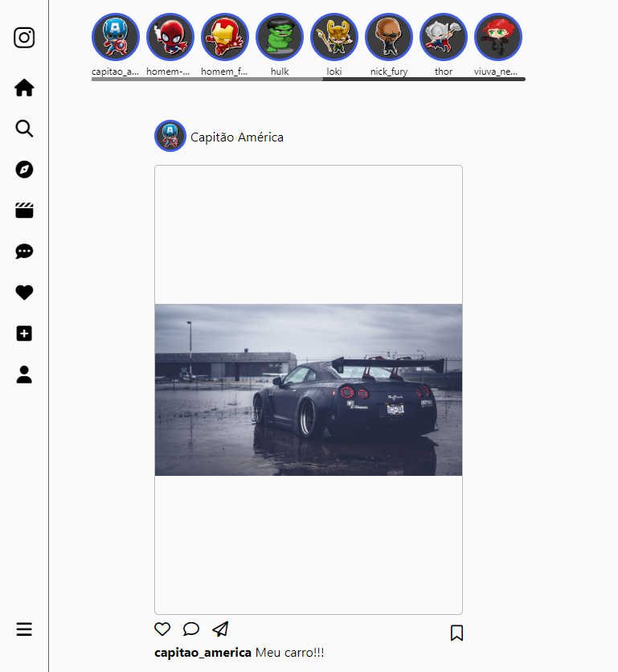

<h1>Instagram Copy</h1>

<p align='center'>Projeto desenvolvido através de um curso de Front-end.</p>
<p align='center'>Nesse projeto foi feito uma cópia do layout do Instagram através de HTML5 e CSS3 com responsividade.</p>
<p align='center'>Na aula foi elaborado a página de login junto ao instrutor e a página de home foi um desafio lançado</p><br>

<h2 alt='#techStack'>⚡️ Tecnologias Utilizadas</h2>
<ul>
  <li><a href='https://html.com/' target="_blank" rel="noopener noreferrer">HTML and CSS</a></li>
</ul><br>

<h2 title='#appDemo'>💻 Demonstração do Aplicativo</h2>

<h2 align='center'>Desktop

<div align='center'><br>
  
  
</div>

<h2 align='center'>Laptop

<div align='center'><br>
  
  
</div>

<h2 align='center'>Tablet

<div align='center'><br>
  
  
</div>

<h2 align='center'>Mobile

<div align='center'><br>
  
  
</div>

<div align='start'>
    <div align='center'>
        <br><h3>Como utilizar em seu computador</h3>
    </div>
  
```bash
# Clone este repositório
$ git clone https://github.com/MarcosCucoro/InstagramCopy.git

# Abra a pasta do projeto em seu VSCode

# Clique com botão direito no index.html e clique em 'Live Server'

# Coloque para inspecionar através do seu navegador

# Clique no ícone de responsividade

# Veja em diferentes tamanhos

# Para acessar a home, basta clicar em 'Entrar' ou 'Entrar com Facebook', você será direcionado para a home.
```
</div>


